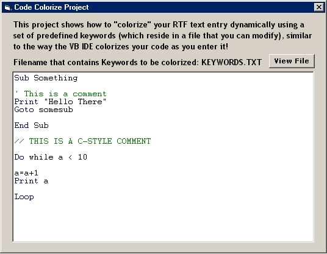



## Syntax Dynamic Colorizer

### Description

This projects shows how to convert an RTF box into a dynamic Syntax Colorizer (like the VB IDE colorizes what you type). It uses a text file to build its list of keywords (are you writing your own scripting language?), which you can easily modify by adding your own list of words/commands. Included is a small subset of the VB language syntax to show an example. Routines are very fast, and account for quotes, and comments. Routine also sets keywords to proper case ("print" to "Print" or "backcolor" to "BackColor". Hope this is helpful to some of you out there - I have commented it heavily to help you if you need to make modifications, or you can simply drop the "Colorizer" module into your own projects and use as is (simply pass your forms RTF box and the colors of your IDE you want).
 
### More Info
 

             |
---                |---
**Submitted On**   |2001-08-06 15:31:00
**By**             |[Anthony Awx](https://github.com/Planet-Source-Code/PSCIndex/blob/master/ByAuthor/anthony-awx.md)
**Level**          |Advanced
**User Rating**    |4.7 (42 globes from 9 users)
**Compatibility**  |VB 5\.0, VB 6\.0
**Category**       |[Miscellaneous](https://github.com/Planet-Source-Code/PSCIndex/blob/master/ByCategory/miscellaneous__1-1.md)
**World**          |[Visual Basic](https://github.com/Planet-Source-Code/PSCIndex/blob/master/ByWorld/visual-basic.md)
**Archive File**   |[Syntax Dyn24185862001\.zip](https://github.com/Planet-Source-Code/anthony-awx-syntax-dynamic-colorizer__1-25915/archive/master.zip)

